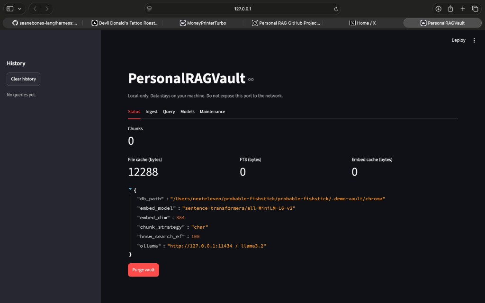
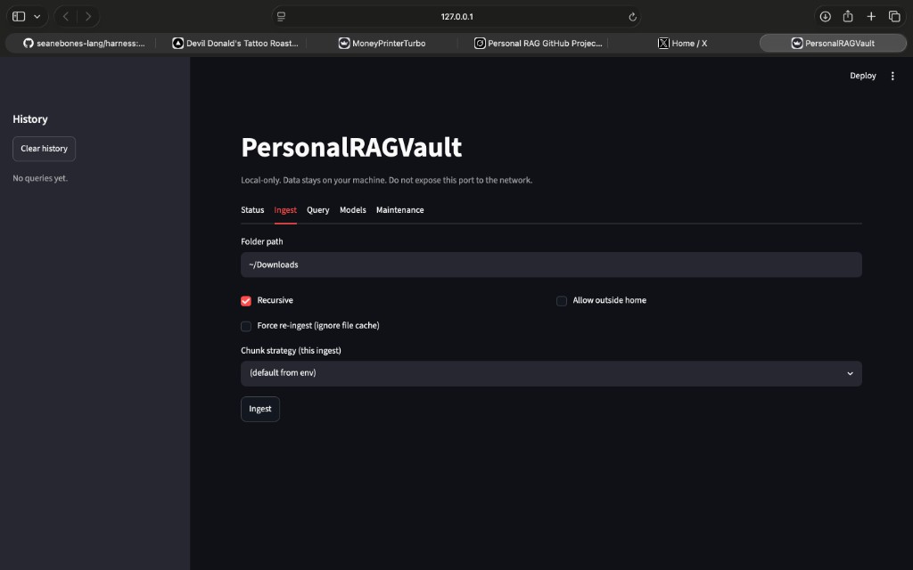
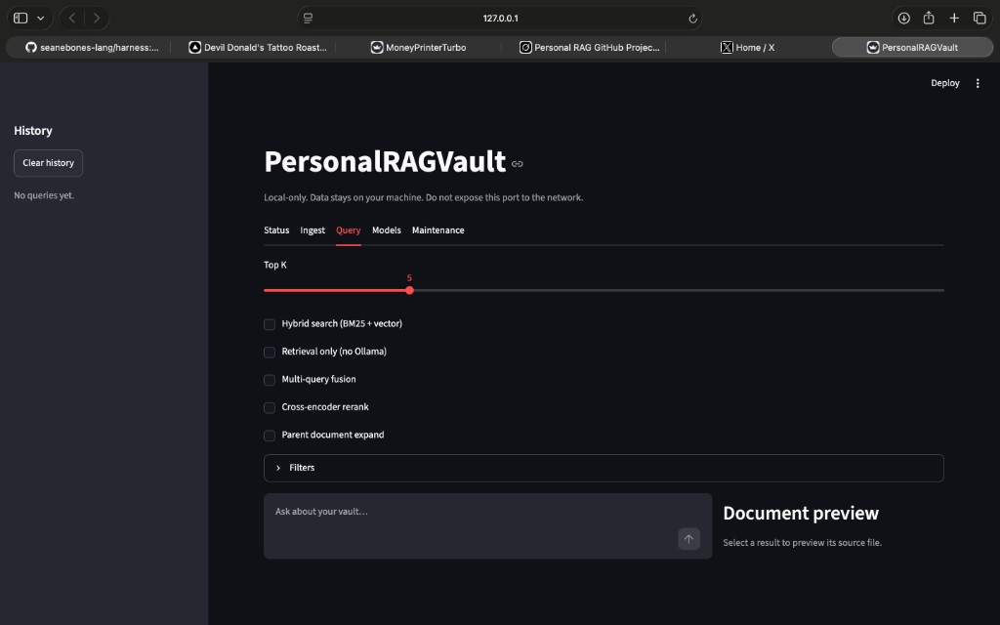
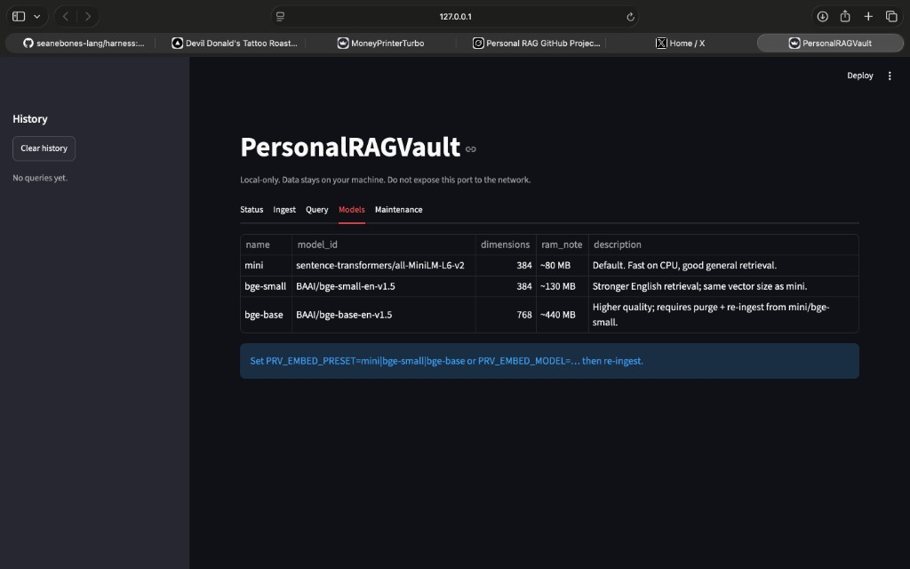
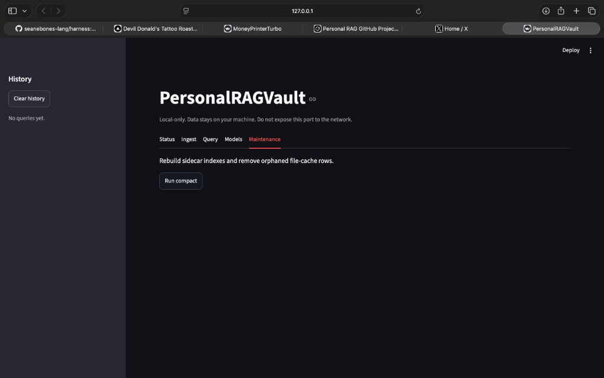

# PersonalRAGVault

[](https://github.com/seanebones-lang/personal-RAG/actions/workflows/ci.yml)
[](LICENSE)
[](https://www.python.org/downloads/)

**Local-first RAG for your personal files.** Ingest PDFs, notes, code, and exports from a folder on your machine, embed them with a lightweight CPU model, store vectors in ChromaDB, and query with natural language—optionally answered by a local [Ollama](https://ollama.com/) model.

No cloud. No account. Your data stays on your disk.

If this project helps you, consider starring the repo on GitHub.

## Why PersonalRAGVault?

- **Private** — runs entirely on your Mac or Linux machine
- **Simple** — one CLI, no Docker or database server to operate
- **Practical** — chunking, dedup on re-ingest, folder watch, retrieval-only mode
- **Hackable** — small Python codebase, documented for contributors

## Features

| Feature | Description |
|---------|-------------|
| Ingest | PDF, TXT, MD, JSON, DOCX, **.ics calendar**, **images (optional OCR)**, and common code/text formats |
| Chunking | Multiple strategies (semantic, prose, Markdown/Python aware) |
| Dedup | Stable chunk IDs; re-ingest updates instead of duplicating |
| Query | Hybrid + multi-query + rerank + parent expansion + **streaming answers** |
| Citations | Model cites sources; CLI automatically extracts and displays them |
| Diagnostics | `doctor` + `config edit` for reliable local operation |
| Watch | Debounced folder watching for automatic re-ingest |
| Manage | `status`, `purge`, `reindex`, `compact`, evaluation tools |

## Recent major improvements

- `personalragvault doctor` — embedding dimension safety, Ollama health, large-vault advice
- `personalragvault config edit` — proper TOML configuration with editor integration
- **Streaming answers** in the CLI (token-by-token)
- Automatic citation extraction and display
- Optional OCR: `pip install "personalragvault[ocr]"`
- Real multi-turn conversations in the UI
- Query timing breakdown

## Quick start

**Run all commands from the project directory** (where `pyproject.toml` lives).

```bash
git clone https://github.com/seanebones-lang/personal-RAG.git
cd personal-RAG

./scripts/setup.sh --dev    # or: python3 -m venv .venv && source .venv/bin/activate && pip install -e ".[dev]"

# Optional but recommended extras
pip install -e ".[ui]"          # Streamlit web interface
pip install -e ".[ocr]"         # OCR for scanned PDFs and images (requires tesseract)

ollama pull llama3.2        # optional; skip if using --no-llm

personalragvault doctor          # recommended first step
personalragvault ingest ~/Downloads
personalragvault query "find my notes about RAG systems"   # now streams + shows citations
```

See **[docs/getting-started.md](docs/getting-started.md)** for the full walkthrough.

### Local web UI

```bash
pip install -e ".[ui]"
personalragvault ui
```

Open **http://127.0.0.1:8501** (localhost only).

## Demo

A short demo GIF or video is one of the best ways to understand the tool.

See [docs/assets/DEMO.md](docs/assets/DEMO.md) for instructions on how to record one.

**Power users**: Once your vault grows beyond ~10k chunks, read the [Large Vaults guide](docs/large-vaults.md).

If you create a nice demo, please consider sharing it (we'd love to feature community contributions).

## Screenshots

Streamlit UI (`personalragvault ui`) — Status, Ingest, Query, Models, and Maintenance tabs.

| Status | Ingest |
|--------|--------|
|  |  |

| Query | Models |
|-------|--------|
|  |  |

| Maintenance |
|-------------|
|  |

## New in v1.0

- `personalragvault eval run` — Hit@k, MRR, and **NDCG@k**; `eval generate` for draft datasets
- **Advanced retrieval:** `--multi-query`, `--rerank`, `--parent-expand`
- **Chunking:** `semantic_embed`, per-extension overrides, `--chunk-strategy` on ingest
- **UI:** chat layout, source highlighting, export JSON/Markdown, richer history

Screenshots live in [docs/assets/screenshots/](docs/assets/screenshots/). See [docs/assets/DEMO.md](docs/assets/DEMO.md) to record a demo GIF.

## New in v0.3

- `PRV_CHUNK_STRATEGY` — `char`, `recursive`, or `prose` chunking
- Telegram `result.json` and Obsidian frontmatter/tag metadata
- UI: result cards, history sidebar, document preview, compact tab
- `PRV_HNSW_SEARCH_EF` / `PRV_USE_EMBEDDING_CACHE` for larger vaults

## New in v0.2

- `personalragvault models list` — embedding presets (mini, bge-small, bge-base)
- `--hybrid` query — BM25 + vector fusion
- `--where-year`, `--source-contains`, `--extension` — metadata filters
- `.eml` / `.mbox` ingest — email archives
- `personalragvault compact` — maintain sidecar indexes
- `personalragvault ui` — optional local Streamlit UI (`pip install -e ".[ui]"`)

## Documentation

| Guide | Description |
|-------|-------------|
| [docs/README.md](docs/README.md) | Documentation index |
| [Getting started](docs/getting-started.md) | Install, ingest, query |
| [CLI reference](docs/cli-reference.md) | Commands and flags |
| [Configuration](docs/configuration.md) | Environment variables |
| [Architecture](docs/architecture.md) | How the pipeline works |
| [FAQ](docs/faq.md) | Troubleshooting |
| [Development](docs/development.md) | Tests, lint, CI |
| [Evaluation](docs/evaluation.md) | Hit@k, MRR, NDCG, synthetic datasets |
| [Community](docs/community.md) | GitHub topics and demo GIF |
| [Contributing](CONTRIBUTING.md) | Issues and pull requests |

## Requirements

- Python 3.10+ (3.10–3.12 tested in CI)
- ~500MB+ disk for dependencies; embedding model downloads on first ingest
- [Ollama](https://ollama.com/) optional (use `--no-llm` without it)

## Commands (summary)

```bash
personalragvault ingest PATH [--recursive] [--verbose]
personalragvault query "QUESTION" [--no-llm] [--top-k N]
personalragvault watch PATH
personalragvault status
personalragvault purge [--yes]
personalragvault reindex PATH [--yes]
```

Alternative entry point: `python -m src.cli <command>`

## Configuration

Copy [`.env.example`](.env.example) to `.env` or export variables. Key settings:

| Variable | Default |
|----------|---------|
| `PRV_DB_PATH` | `~/.personalragvault/chroma` |
| `PRV_EMBED_MODEL` | `sentence-transformers/all-MiniLM-L6-v2` (~22M params) |
| `OLLAMA_MODEL` | `llama3.2` |

Full list: [docs/configuration.md](docs/configuration.md)

## Development

```bash
make setup-dev    # venv + editable install with dev tools
make check        # ruff + mypy + pytest
```

Details: [docs/development.md](docs/development.md)

## Contributing

Contributions are welcome. Please read [CONTRIBUTING.md](CONTRIBUTING.md) and [CODE_OF_CONDUCT.md](CODE_OF_CONDUCT.md).

- [Report a bug](https://github.com/seanebones-lang/personal-RAG/issues/new?template=bug_report.yml)
- [Request a feature](https://github.com/seanebones-lang/personal-RAG/issues/new?template=feature_request.yml)

## Security

See [SECURITY.md](SECURITY.md) for how to report vulnerabilities.

## Changelog

See [CHANGELOG.md](CHANGELOG.md).

## License

MIT — see [LICENSE](LICENSE). Copyright (c) 2026 Sean McDonnell.
