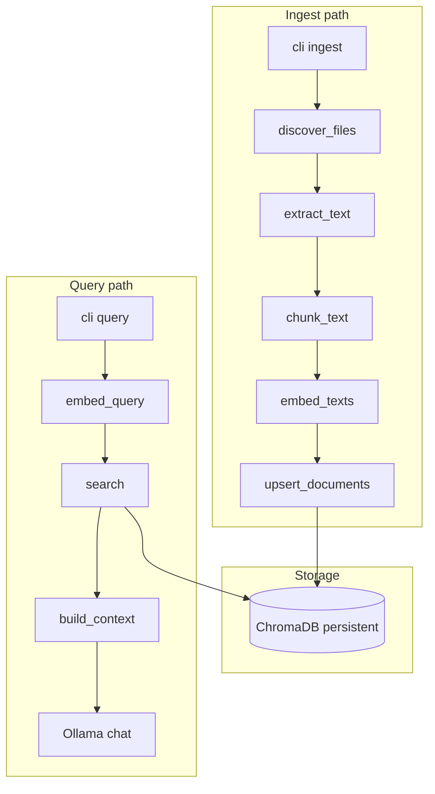

# Architecture

PersonalRAGVault is a small Python CLI pipeline: **discover → extract → chunk → embed → store → retrieve → (optional) generate**.

## Module layout

| Path | Responsibility |
|------|----------------|
| [`src/cli.py`](../src/cli.py) | Typer commands, Rich output, orchestration |
| [`src/config.py`](../src/config.py) | Environment-based settings |
| [`src/ingest/ingest.py`](../src/ingest/ingest.py) | File discovery, validation, text extraction |
| [`src/ingest/chunking.py`](../src/ingest/chunking.py) | Overlapping text chunks |
| [`src/ingest/pipeline.py`](../src/ingest/pipeline.py) | Build chunk documents + stable IDs |
| [`src/ingest/watcher.py`](../src/ingest/watcher.py) | Debounced filesystem watch |
| [`src/embed/embedder.py`](../src/embed/embedder.py) | sentence-transformers (CPU) |
| [`src/store/vectorstore.py`](../src/store/vectorstore.py) | ChromaDB client, upsert, search |
| [`src/ollama_client.py`](../src/ollama_client.py) | Model preflight, prompt generation |

## Ingest flow (detail)

1. **Validate path** — must exist, be a directory; by default must live under `$HOME` unless `--allow-outside-home`.
2. **Discover files** — non-recursive by default; filter by `SUPPORTED_EXTENSIONS`.
3. **Extract text** — PDF via `pypdf`, DOCX via `python-docx`, others as UTF-8. Files over `PRV_MAX_FILE_BYTES` are skipped.
4. **Chunk** — sliding windows of `PRV_CHUNK_SIZE` with `PRV_CHUNK_OVERLAP`.
5. **Stable IDs** — SHA-256 of `source + chunk_index + text` (first 32 hex chars) so re-ingest updates the same logical chunk.
6. **Dedup** — `delete_by_sources` for touched files, then `upsert` new chunks.

## Query flow (detail)

1. Embed the user question with the same model used at ingest.
2. **Vector search** in Chroma (`n_results = min(top_k, collection.count())`).
3. Optional **distance filter** via `--max-distance`.
4. **Context assembly** — join chunks up to `PRV_MAX_CONTEXT_CHARS`.
5. **Ollama** — unless `--no-llm`; preflight checks host and model name.

## Design choices

| Choice | Rationale |
|--------|-----------|
| Local ChromaDB | No server setup; data stays on disk |
| MiniLM embeddings | Small, fast on CPU (~22M parameters) |
| Character chunking | Simple, no extra tokenizer dependency |
| Upsert + delete-by-source | Safe re-ingest without duplicate chunks |
| No HTTP API | Scope: personal CLI tool, not a hosted service |

## Extending the project

- **New file types** — add extension to `SUPPORTED_EXTENSIONS` and an extractor in `extract_text`.
- **Different embedder** — set `PRV_EMBED_MODEL`; ensure dimension stays consistent (purge vault after model change).
- **Custom prompts** — edit prompt template in `src/cli.py` or add config later.

See [Development](development.md) for tests and CI.
